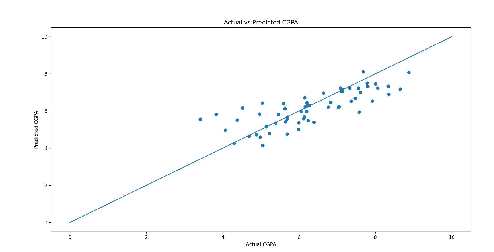

# Student-CGPA-Prediction-with-Recommendations-using-Linear-Regression
A Machine Learning project that predicts student CGPA using Linear Regression based on study hours, attendance, and extracurricular participation and based on the predicted CGPA this model also recommends the student on how to increase CGPA to them who needs improvement and also motivates the student who are already doing good.

# Dataset
Data is created manually in code itself.

## How to Run
1. Install dependencies: `pip install -r requirements.txt`
2. Run the code: `python cgpa_prediction.py`

## Results
Accuracy plot:

Recommendations output:
Input: StudyHours, attendance, assignments scores, previousCGPA , Sleep hours , Extracurricular Score
Output: Predicted CGPA: 6.09 

Recommendation: Academic improvement needed. Increase study hours and attendance.
